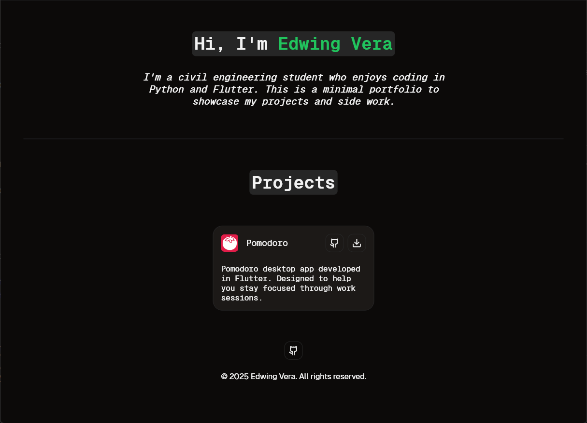

# My Portfolio

A minimal portfolio website built with Flutter to showcase my projects and work.

## ✨ About

Hi, I'm **Edwing Vera**, a civil engineering student who enjoys building simple and clean applications using **Flutter** and **Python**.  
This is a personal portfolio to highlight my projects and some side experiments.

## 🚀 Features

- Minimal responsive design
- Projects showcase
- GitHub integration (Future)
- Clean and modular Flutter code

## 🧠 Tech Stack

- [Flutter](https://flutter.dev/)
- [shadcn_flutter](https://pub.dev/packages/shadcn_flutter)
- [url_launcher](https://pub.dev/packages/url_launcher)